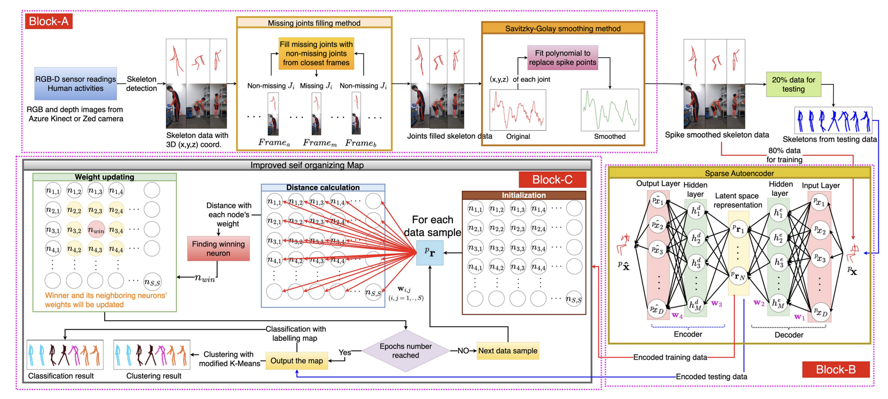

<div align="center">

<h2>From Seeing to Recognising: An Extended Self-Organizing Map for Human Postures Identification (RA-L/ICRA 2025)</h2>

<p>
  <b><a href="https://github.com/qqwwqwq">Xin He</a><sup>1, 2</sup></b> &nbsp;&nbsp;
  <b>Teresa Zielinska<sup>2</sup></b> &nbsp;&nbsp;
  <b>Vibekananda Dutta<sup>2</sup></b> &nbsp;&nbsp;
  <b>Takafumi Matsumaru<sup>1</sup></b> &nbsp;&nbsp;
  <b>Robert Sitnik<sup>2</sup></b>
</p>

<p>
  <sup>1</sup>Waseda University, Japan <br>
  <sup>2</sup>Warsaw University of Technology, Poland
</p>

<p>
  <a href="https://github.com/qqwwqwq?tab=repositories](https://github.com/qqwwqwq/DualSOM"></a>
  <a href="https://ieeexplore.ieee.org/document/10608412"></a>
  <a href="https://www.youtube.com/watch?v=8tfM_N9VAjk"></a>
  <a href="https://github.com/qqwwqwq/DualSOM/stargazers"></a>
</p>

<hr>
</div>

This repository provides the official implementation of **DualSOM**, a dedicated method for **Human Posture Recognition**, which serves as a foundational step for sequence-based human action recognition. Our framework introduces an **Extended Self-Organized Map (SOM)** combined with a **Sparse Autoencoder (SAE)**. The SAE effectively reduces data dimensionality while strictly preserving essential spatial characteristics. The latent representations are then processed by our extended SOM, which leverages unlabeled data to accurately classify and cluster human postures.

## 🕸️ Network Architecture

<p align="center">
  
</p>

## 📊 Qualitative Results

<p align="center">
  
</p>

## 📂 Data Preparation

### Supported Datasets
Our framework currently supports and has been heavily evaluated on two skeleton-based human posture datasets:
* **WUT** (Warsaw University of Technology Dataset)
* **PKU-MMD** (Peking University Dataset)

### 1. Download Datasets
* **WUT Dataset**: Download the skeleton-only dataset from [https://drive.google.com/file/d/19IMwA_N7HC-RfstoInZxLx8BF5Lge99q/view?usp=sharing](#).
* **PKU Dataset**: Download the skeleton-only dataset from [https://drive.google.com/file/d/19ATaTph3IBtfdKRzLkro9Es1wPW7aCf6/view?usp=sharing](#).

### 2. Directory Structure
After downloading and extracting, please put the raw data into the following directory structure before training:

```text
DualSOM/
├── Datas/
│   ├── WUT/
│   │   ├── WUT_data_train/  # Training csv files
│   │   ├── WUT_data_test/  # Testing cvs files
│   │   └── Preprocessed_data/   # Preprocessed data which can be directly used
│   └── PKU/
│   │   ├── PKU_data_train/  # Training csv files
│   │   ├── PKU_data_test/  # Testing cvs files
│   │   └── Preprocessed_data/   # Preprocessed data which can be directly used
├── DaulSOM.py
├── sparse_autoencoder.py
├── main.py
└── ...
```

### 3. Data Processing
You don't need to manually preprocess the skeleton coordinates or labels. The `preprocessing.py` script automatically handles the entire pipeline:
1. **Raw Data Merging:** Scans and merges all raw `.csv` files from the specified folder.
2. **Feature Cleaning:** Automatically imputes missing values and performs **L2 Normalization** on the feature vectors.
3. **Label Encoding:** Dynamically maps the raw string labels to numeric IDs based on the provided `--dataset_name` (`wut` or `pku`).
4. **Smart Caching:** Saves the cleaned data into `.csv` files under auto-generated `/Datas/WUT/Preprocessed_data/` or `/Datas/PKU/Preprocessed_data/` directories. **On subsequent runs, the script will automatically detect and instantly load these cached files instead of reprocessing the raw data, drastically speeding up the execution.**

To point the code to your specific data paths, simply use the `--train_path` and `--test_path` arguments:
```bash
# Example: Process and train on the PKU dataset
python main.py --dataset_name wut \
    --train_path ./Datas/WUT/WUT_data_train/ \
    --test_path ./Datas/WUT/WUT_data_test/

## 🚀 Training and Evaluation

You can execute the entire pipeline (Data Loading $\rightarrow$ Sparse Autoencoder $\rightarrow$ DualSOM) using `main.py`. The framework offers a high degree of flexibility through command-line arguments.

### 1. Execution Modes

The repository supports two distinct branches for final evaluation, perfectly matching the concepts proposed in the paper:

**Branch A: Supervised Classification (Default)**
This mode maps the trained Kohonen layer neurons to ground-truth labels and calculates standard classification metrics (Accuracy, Precision, Recall, F1).
```bash
python main.py --run_mode supervised
```

**Branch B: Unsupervised Regrouping (Algorithm 2)**
This mode executes the proposed *Algorithm 2: K-Means for Regrouping the Neurons*. It clusters the trained neurons based on their angular distance without using any labels, and evaluates the performance using external clustering metrics (NMI, AMI, Homogeneity, Completeness).
```bash
# Example: Regrouping the SOM neurons into 5 clusters
python main.py --run_mode unsupervised --n_clusters 5
```

### 2. Training Speed Control (Fast Mode)

By default, the SOM evaluates the validation accuracy every 5 epochs to plot the training curve. If you want to maximize training speed without intermediate evaluations, you can toggle the validation flag:

```bash
# Standard Mode: Evaluates accuracy periodically (Default)
python main.py --som_enable_validation 1

# Fast Mode: Disables intermediate validation for maximum speed
python main.py --som_enable_validation 0
```

### 3. Checkpointing & Auto-Loading

To prevent redundant and time-consuming training, our framework automatically saves the trained models into the `Pretrained_models/` directory. By default, if the script detects existing weights, it will **instantly load them** and skip the training phase.

You can explicitly control this behavior using the force-train flags:
```bash
# Instant Evaluation: Load existing AE and SOM, jump straight to testing
python main.py --force_train_ae 0 --force_train_som 0

# Force Retrain: Ignore existing checkpoints and train both models from scratch
python main.py --force_train_ae 1 --force_train_som 1
```

### 4. Hyperparameter Configuration

You can easily adjust the dataset, network architectures, and training parameters via the command line.

**Dataset Selection:**
```bash
python main.py --dataset_name pku  # Options: 'wut' or 'pku'
```

**Sparse Autoencoder (SAE) Settings:**
```bash
python main.py \
    --ae_epochs 150 \
    --ae_batch_size 32
```

**Extended SOM Settings:**
```bash
python main.py \
    --som_epochs 50 \
    --som_size_index 10.0 \
    --som_sigma 4.0 \
    --som_lr 0.1
```

### 🎯 Quick Start Examples

**Scenario 1:** Train from scratch on the PKU dataset at maximum speed, then run unsupervised clustering (8 clusters).
```bash
python main.py --dataset_name pku --force_train_ae 1 --force_train_som 1 --som_enable_validation 0 --run_mode unsupervised --n_clusters 8
```

**Scenario 2:** Tweak the number of clusters to 10 and re-evaluate instantly using the auto-loaded model (no retraining needed!).
```bash
python main.py --dataset_name pku --force_train_som 0 --run_mode unsupervised --n_clusters 10
```

## 📧 News
* **[2025.05.21]** 🔥 Our paper is presented at the **2025 International Conference on Robotics and Automation (ICRA)**!
* **[2024.07.12]** 🎉 Our paper is accepted by **IEEE Robotics and Automation Letters (RA-L)**!

## 📜 Reference
If you find our work useful, please consider citing:

```bibtex
@ARTICLE{10608412,
  author={He, Xin and Zielinska, Teresa and Dutta, Vibekananda and Matsumaru, Takafumi and Sitnik, Robert},
  journal={IEEE Robotics and Automation Letters}, 
  title={From Seeing to Recognising–An Extended Self-Organizing Map for Human Postures Identification}, 
  year={2024},
  volume={9},
  number={9},
  pages={7899-7906},
  doi={10.1109/LRA.2024.3433201}
}
